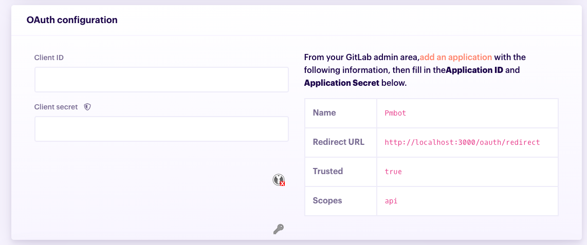

# Git Providers

## Add a git provider

1. At the top of the app, click **Git Providers**

    
1. In the Git provider list, click "Add"

    
1. Select a type of Git provider

    
1. Configure OAuth by filling the **Client ID** and **CLient Secret**

    
1. Test that the connection works by clicking **Run test**. Pmbot checks that the settings are correct by signing you in the Git provider. This will open a dialog in which you will be asked by your Git provider to authorize Pmbot.
    

        If you run the test several times, you may only be asked once to authorize Pmbot. Github, Gitlab and other providers remember that you have granted access to your account. 
    

1. Configure settings specific to your git provider organization [organization settings](#git-provider-organization-settings).
1. Click **Save**

## OAuth configuration

### Gitlab

    Checkout our [video]() on how to configure Gitlab as a Git provider.

 

From your **[admin area](https://docs.gitlab.com/ee/integration/oauth_provider.html#adding-an-application-through-the-profile)**, create an application with the following settings:

| ---- | ---- |
| Name   | Pmbot | 
| Redirect URL | https://app.pmbot.io/oauth/redirect |
| Trusted | true |
| Scopes | api |

After creating the application, Gitlab will give you both the **Client ID** and **Client Secret**, which they respectively name **Application ID** and **Application Secret**.

### Github

    Checkout our [video]() on how to configure Github as a Git provider.

From your admin area, [add an OAuth application](https://developer.github.com/apps/building-oauth-apps/creating-an-oauth-app/) with the following settings:

## Git provider organization settings

### Gitlab

### Github

With Github, you have to grant access to each organization separately for it to be seen.
1. Settings -> Applications -> Authorized OAuth Apps -> Pmbot -> Revoke access
2. Disconnect provider and try connect again, this time click "grant" on the organization you want to see in the list
3. Or, if your want to revoke access to a specific org, go to your organization Setting -> Third Party Access -> revoke access

## Sign in and out of a git provider

    You only see projects for git providers that you are signed into

 
