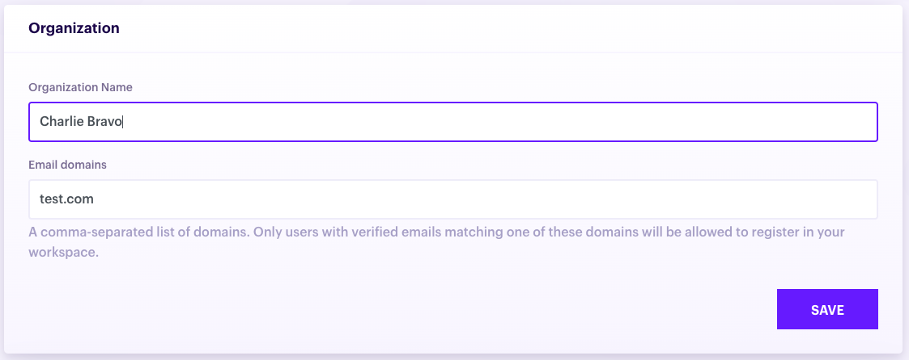
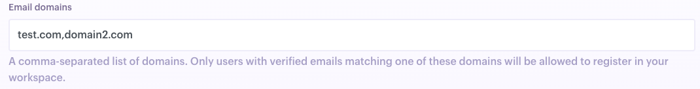
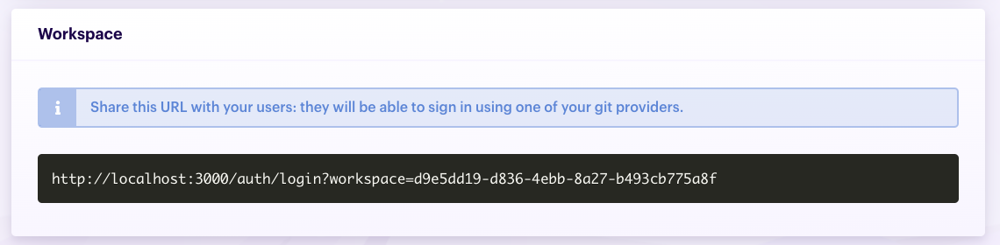
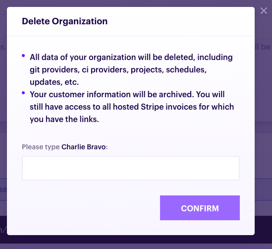
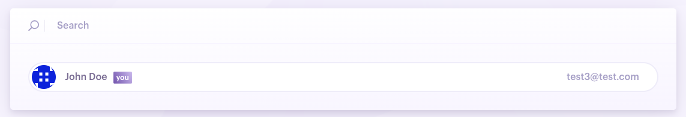
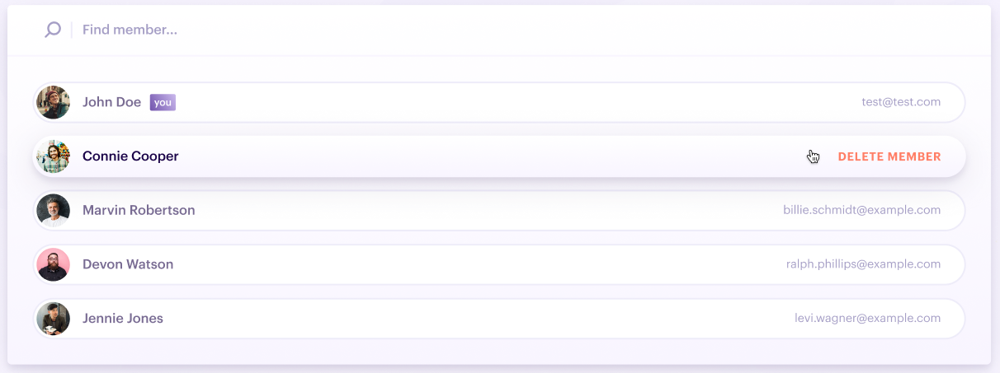
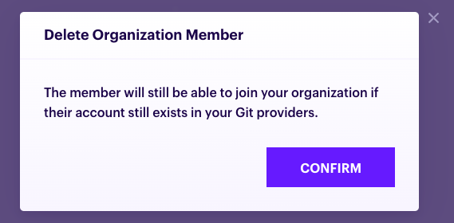

# Organization

When you register a Pmbot account, we create an organization an assign you as the owner.

## Organization settings

To access your organization settings:

1. Click **Settings** in the user dropdown menu at the top right of the UI:

    
    
1. Click the **Organization** tab

    

Here you can change your organization name and configure [email domains](#limit-who-can-sign-up-into-your-workspace):

1. Edit the form

    
    
1. Click **Save**

    
    
### Limit who can sign up into your workspace

When you want to limit who can sign up to your workspace, you can define a list of comma-separated domains. When a user tries to sign up in your workspace, we match their email against the list of domains you defined. If the email doesn't match, we deny the registration.

### Workspace

To onboard new users into your organization, they will need to sign up to your Pmbot organization's workspace. You can find your workspace URL in your organization settings:

### Delete an organization

When you delete your organization, you loose all of its data. This includes Git providers, CI providers, projects, users.

If you use Pmbot cloud, you will also loose access to your billing manager but you will still have access to hosted invoices. For legal and accounting reasons, we will keep records of invoices and customer information.

If you want to delete your organization, you need to:

1. Go to your organization settings
2. Click **Delete**

    
    
3. In the dialog that opens, fill in the name of your organization, then click **Confirm**

    

## Users / Members

You can view users of your Pmbot organization in the **Members** section:

1. Click **Settings** in the user dropdown menu at the top right of the UI:

    

1. Click the **Members** tab

    
    
1. You are now presented with the list of your members

    
    
### Delete a user

Deleting a user will prevent him from signing in your organization. It will delete all of its project permissions, but we do not delete the projects that this user has configured: you will need to delete them manually. Also, deleteing a user does not prevent him from registering again to your workspace. See how you can [restrict who can sign up to your workspace](#limit-who-can-sign-up-into-your-workspace).

To delete a user:
1. Click on the member you want to delete in the member list

    
    
1. In the dialog that opens, click **Confirm**

    
