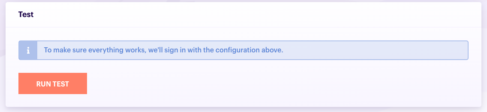
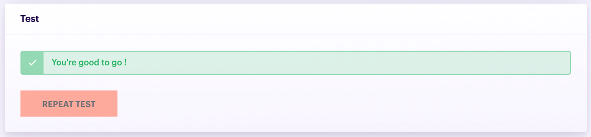
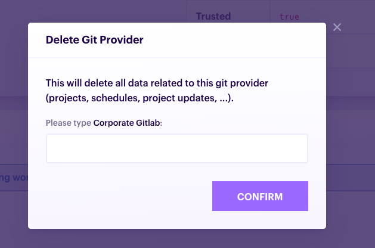
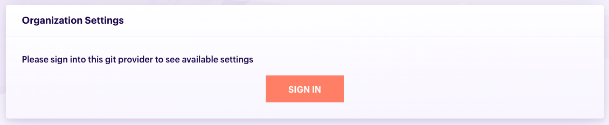

# Git Providers

## Add a git provider

1. At the top of the app, click **Git Providers**

    
1. In the Git provider list, click "Add"

    
1. Select a type of Git provider

    
    
    

    
    Once the Git provider is created, you won't be able to change its type.
    
    

    
1. Configure **General Settings**. See how to configure a specific Git provider:

    - [Gitlab](/git-providers/gitlab#general-settings)
    - [Github](/git-providers/github#general-settings)

1. For Pmbot to be able to interact with your Git servers's API to fetch projects and permissions, you need to register it as an OAuth application in your Git platform and then fill in the **Client ID** and **CLient Secret**. See how to register an OAuth application in your specific Git provider type:
    
    - [Gitlab](/git-providers/gitlab#oauth-configuration)
    - [Github](/git-providers/github#oauth-configuration)
   
1. Test that the connection works by clicking **Run test**. Pmbot checks that the settings are correct by signing you in the Git provider. This will open a dialog in which you will be asked by your Git provider to authorize Pmbot.
    

    
    If you run the test several times, you may only be asked once to authorize Pmbot. Github, Gitlab and other providers remember that you have granted access to your account. 
    
    

    
    
    
    Once the test is complete, you can proceed to the next steo.
    
    
1. Configure [**organization settings**](#git-provider-organization-settings).

1. Click **Add git provider**

    
    
## Update a git provider

1. At the top of the app, click **Git Providers**

    
    
1. In the Git provider list, click the one you want to edit

    
    
1. Edit any of the data on the page
1. To save the changes, click **Update** at the bottom of the page

    

## Delete a git provider

1. At the top of the app, click **Git Providers**

    
    
1. In the Git provider list, click the one you want to delete

    
    
1. At the bottom of the page, click **Delete**.

    
    
    When you click the button, a dialog opens up and you are asked to type in the name of your Git provider before being able to click the **Confirm** button.
    
    
    
    Once the provider is deleted, you will be redirected to the Git provider list.

## Git provider organization settings

Pmbot allows you to configure how it interacts with your git provider organization. This is particularly useful when you want to limit which projects can be seen by your users.

Because these settings require interacting with your git provider's API, you will have to be [signed in](#sign-in-and-out-of-a-git-provider) the git provider you are configuring. Pmbot will let you do this by showing you a **Sign in** button:

See how to configure your specific Git provider:

- [Gitlab](/git-providers/gitlab#organization-settings)
- [Github](/git-providers/github#organization-settings)

## Sign in and out of a git provider

Once a Git provider is created (or when testing it during its creation), you can sign in an out of it. 

When you sign-in, a dialog opens and you are asked to authorize the Pmbot application you have previously [created](#oauth-configuration) in that specific provider. When doing so, your Git platform provides Pmbot with an OAuth API token which allows Pmbot to interact with its API.

After your first sign-in, Github and other Git platforms remember that you have granted access to your account, so next time you sign-in, the dialog will disappear quickly as you don't need to authorize Pmbot a second time. If you want to revoke the authorization, you can do so in your Github or Gitlab account settings. 

When you sign out, Pmbot removes the API token stored. Note that this does not remove the authorization you have granted on your Git platform.

Each time you sign in a Git provider, Pmbot synchronizes your Git repositories and permissions.

You only see projects for git providers that you are signed into

### Sign in

You can sign in a Git provider in the following ways:

1. By running the test when [creating a git provider](#add-a-git-provider)
1. By clicking the **Sign in** button in the Git provider list

    
1. By clicking the **Sign in** button in the Git provider page

    

Once you are signe-in, we display your username. This is useful when you are signed in multiple Git providers:

### Sign out

To sign out of a Git provider, you can:

1. Click the **Sign out** button in the Git provider list

    
1. By clicking the **Sign in** button in the Git provider page

    

## Synchronize Git providers

When you sign in a Git provider, we automatically fetch all your Git repositories and permissions. However, sometimes, you may need to resynchronize your repositories, as Pmbot does not perform this task periodically to prevent overloading third party APIs.

To manually synchronize:

1. At the top of the app, in the nav bar, click **Sync**

    
    
1. Wait for the synchronization to complete. You can view the progress of the synchronization as the number of Git providers synchronized/

    
    
You cancel a synchronization by clicking **Cancel**

Any sync starts by deleting all of your permissions (not the projects), hence you may have an empty project list after cancelling the sync. Synchronize again and all of your projects should show up.

