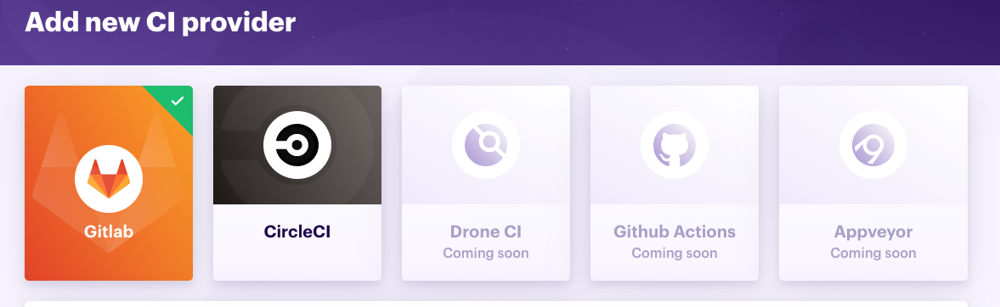
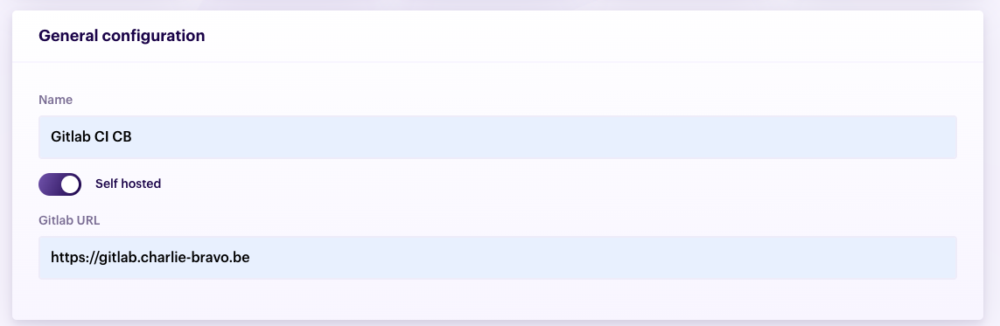
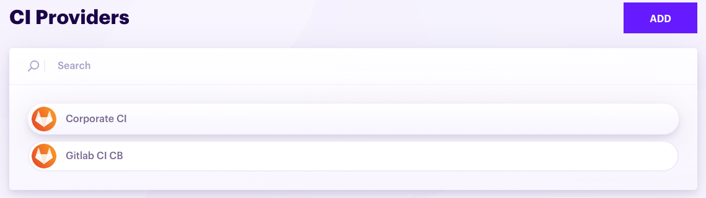
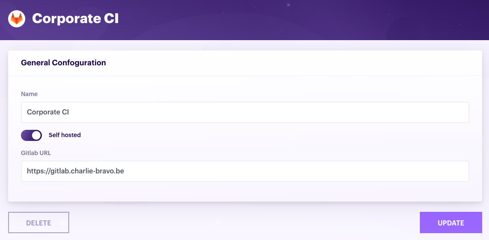
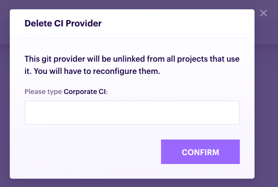

# CI Providers

## Add a CI provider

1. At the top of the app, click **CI Providers**

    
    
1. In the Git provider list, click "Add"

    

1. Select the type of CI provider you want to add

    
    
1. Configure **General Configuration**. These fields may vary based on the type of CI provider selected. See the specific configuration for your provider:

    - [Gitlab CI](/ci-providers/gitlab-ci#provider-settings)    
    - [Drone CI](/ci-providers/drone-ci#provider-settings)
    - [Circle CI](/ci-providers/circle-ci#provider-settings)

    
    
1. Click **Add CI provider**

    
    
## Edit a CI provider

1. At the top of the app, click **CI Providers**

    
    
1. In the CI provider list, select the one you want to edit

    
    
1. Edit the settings

    
    
1. To save the changes, click **Update**

    
    
## Delete a CI provider

1. At the top of the app, click **CI Providers**

    
    
1. In the CI provider list, select the one you want to delete

    

1. Click **Delete**

    

   When you click the button, a dialog opens up and you are asked to type in the name of your CI provider before being able to click the **Confirm** button.
       
   
   
   Once the provider is deleted, you will be redirected to the CI provider list.

    

        When you delete a CI provider, you will have to reconfigure a CI for each project it was used in.
    

