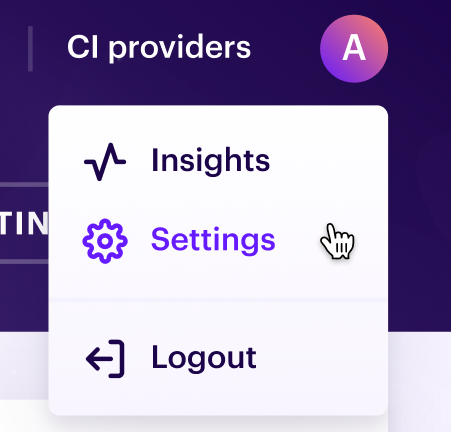
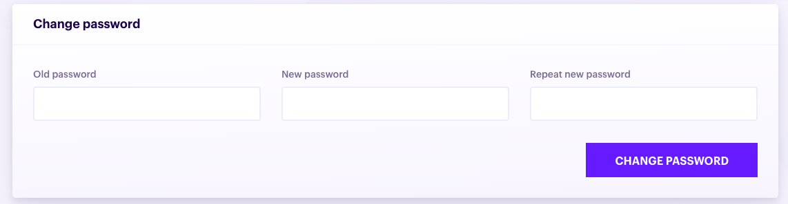

# User settings

User settings allow you to manager settings for your Pmbot account, such as changing your password or disconnecting from all devices.

## View user settings

To access user settings:

1. Click **Settings** in the user dropdown menu at the top right of the UI:

    
    
1. Click the **Organization** tab

    
    
## Change your password

To change your password

1. Fill in the **Change password** form by providing your old password, new password and confirming the new password

    

1. Click **Change password**

    
    
## Disconnect from all devices

If you want to disconnect all devices that have signed in your Pmbot account, you will need to click the **Revoke all tokens** button:
    

## Refresh token

Use this to refresh your authentication token. This is deprecated as of **v1.0.0**.
