# Projects

Projects allow run update for a given Git repository on a specific CI platform and with specific schedules.

<div class="table-of-content"></div>

## Add a project

1. In the top nav bar, click **Projects**

    
    
1. If you have no projects, you'll see an empty page. Click **Add first project**

    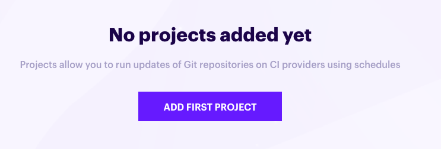
    
    Otherwise, click **Add project**
    
    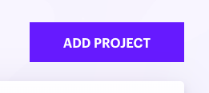

1. Select a Git repository. If you don't see any repositories in the list, make sure to [synchronize your Git providers](/git-providers#synchronize-git-providers).

    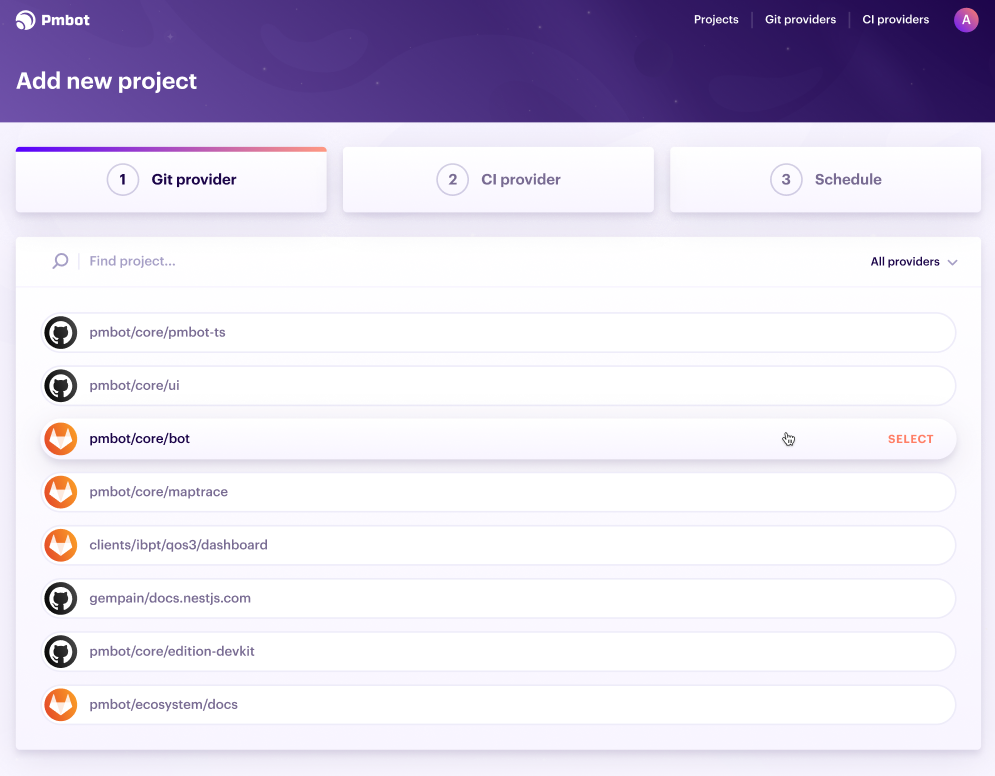
    
1. Select the CI provider on which you want to run updates

    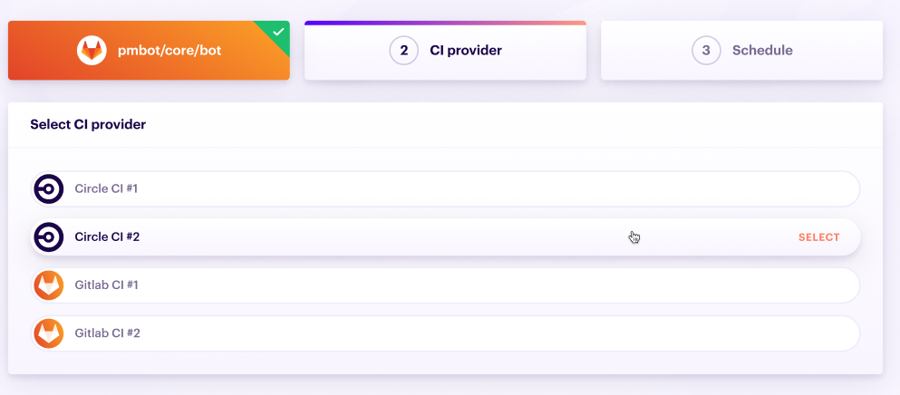
    
1. Configure the selected CI provider for this repository. See [here](#ci-provider-project-configuration) for the configuration for the type of CI provider your have selected.

    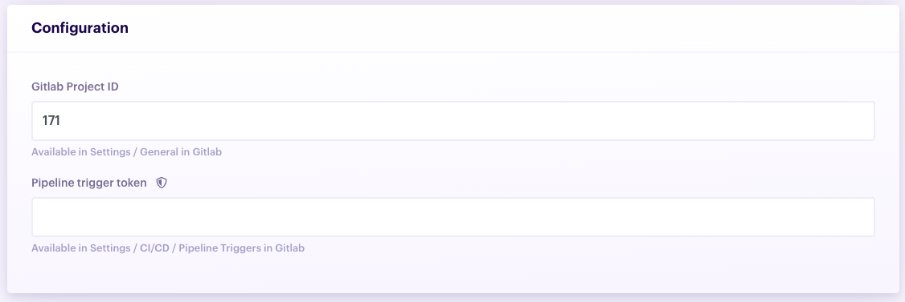
    
1. Click **Next step**

    
    
1. Add a schedule by clicking **Add schedule**

    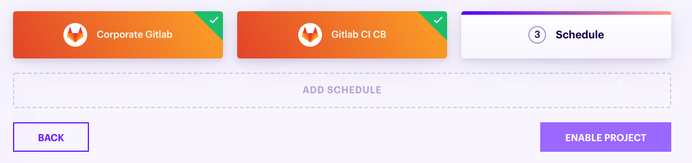
    
    <div class="blockquote" data-props='{ "mod": "warning" }'>
    
    As a cloud user, depending on your plan, you may be limited to how many schedules you can add. In that case, the **Add branch** button will be disabled.
    
    </div>
        
1. Select the Git branch you wish to update, set the **timezone**, and **period**

    
    
1. Click the **Save** button in the schedule form
    
    
    
1. Once you have saved the schedule, you can click **Add project**

    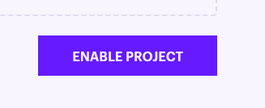
    
    You will be redirected to your project's page where you can then setup Git credentials and prepare your [`.pmbot.yml`](/pmbot-yml/pmbot-yml) file.

## Project details page

To open the project details page:

1. In the top nav bar, click **Projects**

    
    
2. Click the project in the list to open its details page
    
    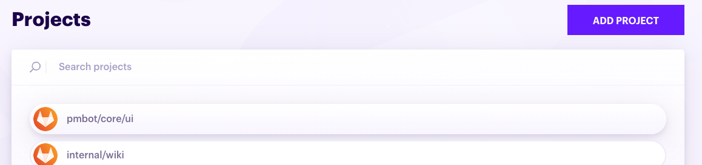

## Delete a project

<div class="blockquote" data-props='{ "mod": "danger" }'>

This action will **delete** all project configurations, updates, schedules, etc.

</div> 

To delete a project:

1. Open the [project details page](#project-details-page)

3. Click the **Delete** button

    

## Schedules

Schedules allow you to configure which branches of your Git repository are updated and when.

### Add schedule

1. Open the [project details page](#project-details-page)
1. In the project details page, click the **Schedules** tab

    
    
1. Click **Add schedule**

    
    
1. Select the Git branch you wish to update, set the **timezone**, and **period**

    
    
    By default we suggest you use predefined **periods** such as **daily** or **weekly**. Prenium users may use cron expressions by toggling **Use cron expression**
    
    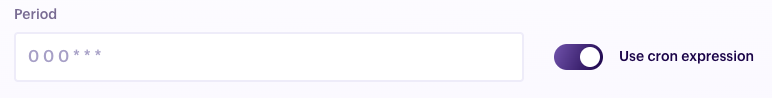

### Update schedule

1. Open the [project details page](#project-details-page)
1. In the project details page, click the **Schedules** tab

    
    
1. Edit any field in the schedule that you wish to update
1. Click **Save**

    

### Delete schedule

1. Open the [project details page](#project-details-page)
1. In the project details page, click the **Schedules** tab

    
    
1. At the top right of the schedule you want to delete, click the cross mark

    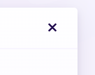

## Updates

When Pmbot updates your project dependencies, it stores all the update information in an object we call project update. You can view this information in your project's **Updates** tab.


    
### How updates work

Pmbot uses your CI to **execute updates**. We leverage conditional pipelines to force your CI to execute a specific job from your CI configuration file. This means that changing files like `package.json`, commit and pushing is done inside a CI pipeline. We provide a docker image that contains our `pmbot` CLI and allows you to run updates in a single command.  

Pmbot updates each dependency one at a time and listens to CI pipelines statuses to know whether the update of a given dependency succeeded or failed. Based on that result, it may rollback the previous dependency update. Then, it moves on to the next dependency that needs to be updated.

Once it has finished updating all dependencies, it executes actions you have configured in your [`.pmbot.yml`](/pmbot-yml/pmbot-yml).

To better understand how things happens, let's take an example of a project `dummy` scheduled to be updated daily on the `dev` branch.
1. Every day, at midnight UTC, Pmbot tells your CI to run a specific job configured in your CI config file in `dummy`.
1. Inside that job, we execute the `pmbot` CLI, which runs the update and communicates with our backend.
    1. Our CLI starts by listing all dependencies and check which ones need to be updated.
    1. Our CLI updates, for example, the Npm dependency `chalk` from `v1.0.0` to `v1.1.0`
    1. Our CLI commits and pushes to `dummy`. As it sees the new commit, your CI automatically starts a new pipeline and runs all jobs configured in your CI config file, such as `build`, `test`, `lint`, etc.  
1. Our backend listens to events from your CI and once it receives whether the commit passed all checks, it triggers a new job on your CI to update the remaining dependencies.
1. Once all dependencies have been updated, our CLI executes all actions configured in your [`.pmbot.yml`](/pmbot-yml/pmbot-yml). For example, you can send Slack messages, emails, open a pull request, or even automatically merge. See the [plugins](/plugins) section for a full list of available plugins and how to write custom plugins. 

### Update list

You can view all updates for a given project as follows:

1. Open the [project details page](#project-details-page)
1. Click the **Updates** tab
1. You are now on the update list

    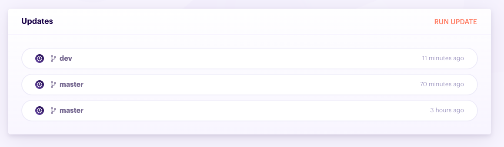

### Run an update

To run an update:

1. Go to the [update list](#update-list)
1. Click **Run now** at the top right of the update list

    
    
1. In the dialog that opens, select the branch on which you want to run an update.

    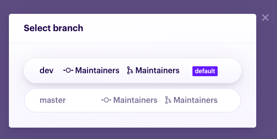
    
1. You are redirected to the details of the update you just triggered

    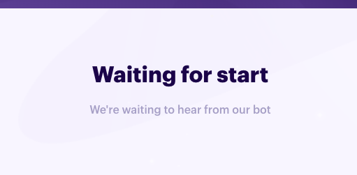

1. Within a few seconds, you should see a link to the CI pipeline that has been started. You may click the pipeline commit hash or status to open its details in your CI platform.
     
    

1. The update details page updates in real time, so you should see your dependencies appear withing a minute or so. See [here](#view-an-update) for more info.

### View an update

1. Open the [project details page](#project-details-page)
1. Click the **Updates** tab
1. Select an update in the list

    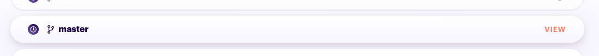
    
1. In the update you will see a list of your package managers. For each package manager, you will see
    - the list of dependencies, their current version, the latest version, the status of and a link to the update job, the statu of and a link to the test CI pipeline
    - the list of actions executed for this package manager update. When an action failed, you can click on it to view the error.
    
## CI

You can configure on which CI platform are run the updates of your project and configure that CI platform for that project in the **CI** tab.

1. Open the [project details page](#project-details-page)
1. Click the **CI** tab

    

If you ever need to change the CI provider after the project is enabled, here is how to do it:

1. Click on the current CI selected for the project

    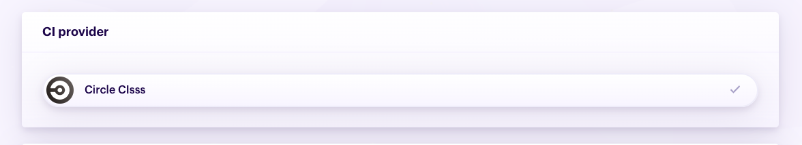

1. Select the CI you want to use

    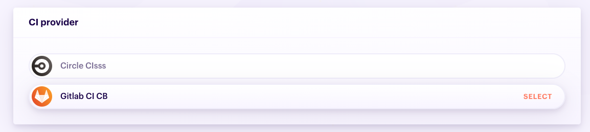

1. Once selected, you can configure the CI for the specific type of CI provider selected. See the specific configurations for your CI provider:

    - [Gitlab CI](/ci-providers/gitlab-ci#project-settings)    
    - [Drone CI](/ci-providers/drone-ci#project-settings)

1. Click **Save** to save the changes.

    <div class="blockquote" data-props='{ "mod": "info" }'>
    
    You must save to store both the selected CI and the settings. Even if you changed the CI provider for another one with the same type and didn't change the settings, you'll have to use the **Save** button.
    
    </div>

### CI provider project configuration

See how to configure your project

## Dependencies

Every time a project update is run, Pmbot stores the current status of your dependencies. To view your current project dependencies:

1. Open the [project details page](#project-details-page)
1. Click the **Dependencies** tab

    

## Setup

Once you have [added a project](#add-a-project), you need to setup the magic that allows Pmbot to communicate with your Git project and CI platform for this specific project.

<div class="blockquote" data-props='{ "mod": "info" }'>

We are aware that this process is a bit tedious and are working on simplifying and automating most of it.

</div>

### Project token

Your project token allows:
- your CI to authenticate to Pmbot when sending pipeline status notifications
- the `pmbot` CLI to authenticate to the Pmbot backend when sending udpate states

<div class="blockquote" data-props='{ "mod": "info" }'>

We advise you to place this token in a secret environment variable named `PMBOT_TOKEN` so you don't event have to pass it via the `--token` property of the `pmbot` CLI. Note that even though this can be considered as a secret, the most harm an attacker can do with it is to call our backend with fake CI results or get project update data (in which we don't pass any sensitive information).

</div>

To view your Pmbot token:

1. Open the [project details page](#project-details-page)
1. Click the **Setup** tab

    

To renew your Pmbot token:

1. Go to the `PMBOT_TOKEN` section, and click **Renew**

    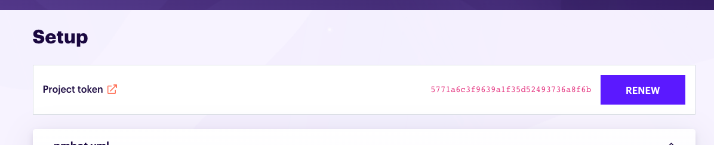

At any time, you can renew your `PMBOT_TOKEN` by clicking the **Renew** button.
    
<div class="blockquote" data-props='{ "mod": "warning" }'>

When you renew the `PMBOT_TOKEN`, you need to reconfigure the webhook in your CI and update the `--token` provided to the `pmbot` CLI in the update job of your [CI config file](#ci-config-file).

</div>

### .pmbot.yaml

First, you'll have to place at your project root a `.pmbot.yml` file. Here is a basic example for updating Npm dependencies and automatically merging when an update succeeds (checkout the [.pmbot.yml reference](/pmbot-yml/pmbot-yml) for more details):

<div class="code-group" data-props='{ "lineNumbers": ["true"] }'>

```yaml
version: "1"
packageManagers:
  - packageManager:
      name: npm
    actions:
      - name: auto-merge
        on:
          - success
```

</div>

### CI config file

To run updates, we leverage conditional CI jobs. You'll need to setup an update job which executes the `pmbot` CLI and add execution conditions to your existing jobs. See how to do this for your specific type of CI provider:

- [Gitlab CI](/ci-providers/gitlab-ci#ci-config-file)    
- [Drone CI](/ci-providers/drone-ci#ci-config-file)

### Webhook

- [Gitlab CI](/ci-providers/gitlab-ci#webhook)    
- [Drone CI](/ci-providers/drone-ci#webhook)

### Git credentials

To be able to push to your Git repository, Pmbot needs to be provided with credentials.

1. Generate an SSH keypair

    <div class="code-group" data-props='{ "lineNumbers": ["true"] }'>
    
    ```shell
ssh-keygen -b 2048 -t rsa -f /tmp/sshkey -q -N ""
    ```
    
    </div>
   
1. Configure the **public key** as a deploy key in your Git server.
   
   For Gitlab, you'll need to add the public key as a [project deploy key](https://docs.gitlab.com/ee/ssh/#per-repository-deploy-keys).
   
   For Github, you'll need to add the public key as a [deploy key](https://developer.github.com/v3/guides/managing-deploy-keys/#deploy-keys).
   
1. Configure the **private key** in a CI environment variable named `PMBOT_SSH_PRIVATE_KEY`.
