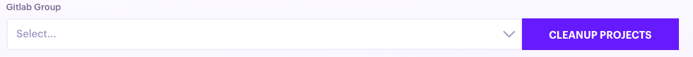
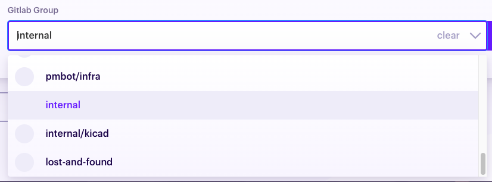

# Gitlab

## General settings

| Field | Description |
| --- | --- |
| Name | The name of your Git provider |
| Gitlab URL | The URL of your Gitlab instance. You must turn on the **self hosted** toggle for this parameter to be visible. |

## OAuth Configuration

From your **[admin area](https://docs.gitlab.com/ee/integration/oauth_provider.html#adding-an-application-through-the-profile)**, create an application with the following settings:

| Field | Value |
| ---- | ---- |
| Name   | Pmbot | 
| Redirect URL | `https://app.pmbot.io/oauth/redirect` |
| Trusted | true |
| Scopes | api |

After creating the application, Gitlab will give you both the **Client ID** and **Client Secret**, which they respectively name **Application ID** and **Application Secret**.

## Organization settings

### Lock projects to a group

This setting allows you to limit projects to a given group. Pmbot will list the groups to which you belong and you may select one of them using the given dropdown.

If no group is selected, your users will be able to configure their personal projects on your Pmbot account.

 

#### Enable group lock

1. Select a group Once you have selected a group, you will need to

    

1. To save the changes, click **Update** at the bottom of the page

    
    
1. Use the **Cleanup Projects** button to cleanup projects that were configured in Pmbot and do not belong to the new group you have selected.

    
    
    

    
    This action will **delete** all projects that belong to that group. You will loose all updates, schedules and configurations of these projects.
    
    
 

#### Disable group lock

If you want to remove the group lock, you need to:

1. Click **clear** on the Gitlab group select input

     
     
1. To save the changes, click **Update** at the bottom of the page

    
