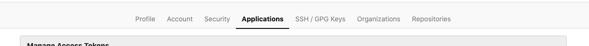
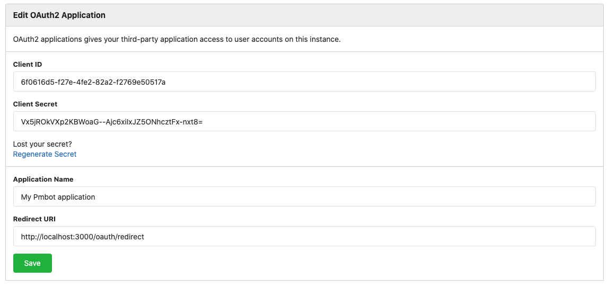
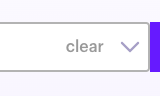

# Gitea

Gitea support requires:
- pmbot/ui v1.18.0+
- pmbot/backend-community (or any premium edition) v1.9.0+
- pmbot/bot (@pmbot/bot) v1.8.0

## General settings

| Field | Description |
| --- | --- |
| Name | The name of your Git provider |
| URL | Your Gitea URL |

## OAuth Configuration

Got to your **Settings**

Go the the **Application** tab

Add an OAuth application with the folloing settings:

| Field | Value |
| ---- | ---- |
| Application name   | Pmbot | 
| Authorization callback URL | `https://app.pmbot.io/oauth/redirect` |

Copy your **Client ID** and **Client secret**:

## Organization settings

### Lock projects to a Gitea Organization

This setting allows you to limit projects to a given Gitea organization. Pmbot will list the organizations to which you belong and you may select one of them using the given dropdown.

#### Enable organization lock

1. Go to your project page
1. Select an organization
1. To save the changes, click **Update** at the bottom of the page
1. Use the **Cleanup Projects** button to cleanup projects that were configured in Pmbot and do not belong to the new group you have selected.

    

    

    
    This action will **delete** all projects that belong to that group. You will loose all updates, schedules and configurations of these projects.
    
    
 

#### Disable organization lock

1. Go to your project page
1. In the **Organization settings**, clear the selection in the **Gitea Organization** dropdown
    
    

1. Click **update**
