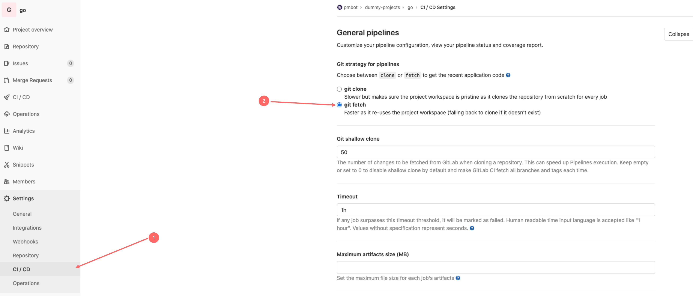

# Gitlab CI

## Repo Setup

1. Activate the repo in Pmbot UI
2. Update in your `.gitlab-ci.yml`. Here is an example for updating Npm dependencies:

<div class="code-group" data-props='{ "lineNumbers": [true], "labels": [".gitlab-ci.yml"] }'>

```yaml
stages:
  - update
  - test
  # must be the last stage !
  - notify

update:
  stage: update
  image: pmbot/bot
  # run the update job only when variable environment $PMBOT is "true"
  only:
    variables:
      - $PMBOT == "true"
  script:
    # install your dependencies
    - npm ci
    # run the update
    - pmbot update --disable-host-key-verification

# your existing build/test jobs
test:
  stage: test
  image: node:12-alpine
  # skip this job when running the update job
  except:
    variables:
      - $PMBOT == "true"
  script:
    - npm ci
    - npm test

# notify pmbot of pipeline success
on-success:
  stage: notify
  image: pmbot/bot
  when: on_success
  script:
    - pmbot notify --success

# notify pmbot of pipeline success
on-failure:
  stage: notify
  image: pmbot/bot
  when: on_failure
  script:
    - pmbot notify

```

</div>

<div class="blockquote" data-props='{ "mod": "info" }'>

`on-success` and `on-failure` are separate jobs because Gitlab CI does not provide a pipeline status variable in the [predefined environment variables](https://docs.gitlab.com/ee/ci/variables/predefined_variables.html). 

</div>

## Self signed certificates

See [`here`](/core/cli#self-signed-certificates).

We recommend setting a [CI/CD variable](https://docs.gitlab.com/ee/ci/variables/) of type [**file**](https://docs.gitlab.com/ee/ci/variables/#custom-environment-variables-of-type-file) at [the group level](https://docs.gitlab.com/ee/ci/variables/#group-level-environment-variables) or the [instance level]() with the path to your CA certificate.

## Untracked files errors or removed commits appearing again

If you forced push to the update source branch, for example `master`, you may experience issues where Git throws an error as the bot tries to `checkout` the update branch. You can work around this problem as follows:

1. Go to your Gitlab project **CI/CD settings**
2. In the **General** section, under **Git strategy for pipelines**, select **Git clone** and then **save** the form.

This will ensure that the workspace is clean for each run.


