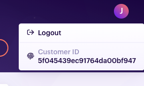

# FAQ

Frequently asked questions

## How to get support

We have a [Github repository](https://github.com/pmbot-io/issues) that we use as issue tracker. If you are a community user, you can open an issue [there](https://github.com/pmbot-io/issues/issues). If you are a premium user, you can open a **private** issue [here](https://github.com/pmbot-io/issues/security/advisories/new). Please format your issue title as `[<customer-id>] <title>` where `<customer-id>` can be found in the main user dropdown of your Pmbot UI:

When you click the customer ID, it will be copied to your clipboard.

## How to report a security vulnerability

If you think you've found a security vulnerability, please report it [here](https://github.com/pmbot-io/issues/security/advisories/new).
